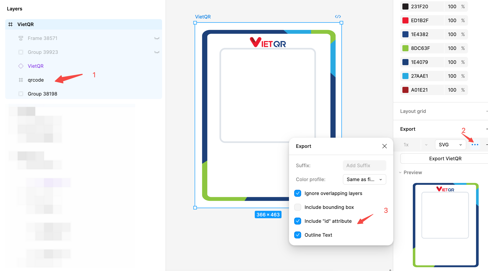

# VietQR Generator

A command-line tool for generating VietQR codes and embedding them into SVG templates.

## Installation

Install globally using npm:
```bash
npm install -g vietqr-gen
```

## Usage

Once installed globally, you can run the tool using:
```bash
vietqr-gen -c <csv-file> [-t <template-file>] -o <output-directory>
```

### Parameters

- `-c, --csv`: CSV file with bank account and VietQR data
- `-t, --template`: SVG template file (defaults to template.svg in package directory)
- `-o, --output`: Output directory for generated files
- `-l, --logo`: Optional logo path:
  - Default: Built-in VietQR logo
  - Use `-l none` to generate QR codes without logo
  - Use `-l path/to/logo.svg` for custom logo

### CSV Format

Required CSV columns:
- `ID`: Identifier (optional)
- `STK`: Bank account reference code
- `GenQR`: VietQR data string

Example CSV:
```csv
ID,STK,GenQR
BIDV1,V3CASLRPR13MT76,00020101021138590010A000000727012900069704180115V3CASLRPR13MT760208QRIBFTTA53037045802VN6304ABD7
BIDV2,V3CASLHRE4GFPY5,00020101021138590010A000000727012900069704180115V3CASLHRE4GFPY50208QRIBFTTA53037045802VN6304B5EA
```

### Template Format

Your SVG template must contain:
```xml
<g id="qrcode">
    <rect width="1299" height="1299" x="642.5" y="1091.5" />
</g>
```

#### Exporting from Figma

To create a compatible template from Figma:

1. Create a frame with your desired design
2. Add a rectangle where you want the QR code to appear
3. Group the rectangle and name the group "qrcode"
4. Export as SVG



## Quick Start

1. Save your VietQR data in a CSV file (e.g., `data.csv`)
2. Run with default template:
```bash
vietqr-gen -c data.csv -o output
```

3. Or use your own template:
```bash
vietqr-gen -c data.csv -t custom-template.svg -o output
```

4. Run with desired logo option:
```bash
# Use default template
vietqr-gen -c data.csv -o output

# Specify custom template
vietqr-gen -c data.csv -t custom-template.svg -o output

# No logo
vietqr-gen -c data.csv -o output -l none

# Custom logo
vietqr-gen -c data.csv -o output -l custom-logo.svg
```

Generated files will be named using the STK values (e.g., `V3CASLRPR13MT76.svg`).

## Dependencies

- qr-code-styling: QR code generation
- csv-parse: CSV file processing
- commander: Command-line interface
- fs-extra: File system operations

## License

MIT License - Copyright (c) 2024 TuanPM

See [LICENSE](LICENSE) for details.
